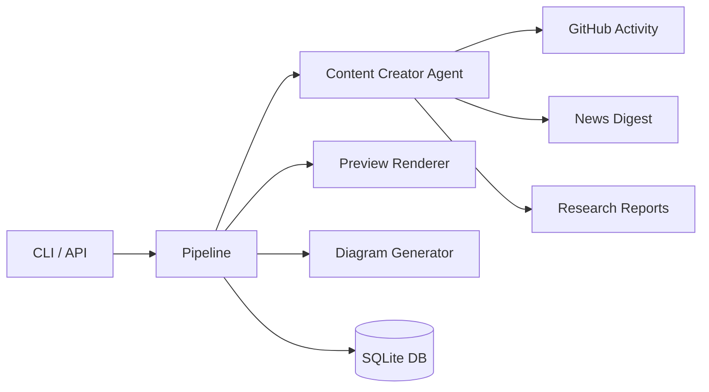

# LinkedIn Content Advisor

AI-powered LinkedIn post drafting from GitHub activity, research reports, and news digests. Generates Hebrew-language posts with dark-mode preview images and optional architecture diagrams.

## Quick Start

```bash
# Clone and install
git clone https://github.com/ShonP/linkedin-advisor.git
cd linkedin-advisor
uv sync

# Configure
cp .env.example .env  # Edit with your API keys

# Generate your first draft
linkedin-advisor draft generate
```

## Configuration

Create a `.env` file with:

```env
AZURE_API_KEY=your-azure-openai-key
OPENAI_BASE_URL=https://your-endpoint.openai.azure.com/openai
MODEL=gpt-5.5
TAVILY_API_KEY=your-tavily-key
GITHUB_USERNAME=YourGitHub
AZURE_IMAGE_ENDPOINT=https://your-endpoint.openai.azure.com/openai/deployments/gpt-image-2/images/generations?api-version=2025-04-01-preview
```

## CLI Reference

### Draft Commands

```bash
linkedin-advisor draft generate [--topic TOPIC]      # Generate a new post draft
linkedin-advisor draft list [--status pending|approved|rejected|all]
linkedin-advisor draft show <ID>                      # Show full draft content
linkedin-advisor draft approve <ID>                   # Approve a draft
linkedin-advisor draft reject <ID>                    # Reject a draft
linkedin-advisor draft edit <ID> <instructions>       # Edit with instructions
linkedin-advisor draft regenerate <ID>                # Re-generate from same topic
linkedin-advisor draft preview <ID>                   # Regenerate preview image
```

### Image Commands

```bash
linkedin-advisor image generate <prompt> [--filename name.png]
```

### Server

```bash
linkedin-advisor serve [--host 0.0.0.0] [--port 8000]
```

### Backward Compatibility

```bash
linkedin-advisor generate [--topic TOPIC]  # Alias for 'draft generate'
```

## Architecture



### Module Overview

| Module | Purpose |
|--------|---------|
| `cli.py` / `cli_draft.py` | Click CLI with resource-based commands |
| `pipeline.py` | Orchestrates draft creation, editing, approval |
| `agents/content_creator.py` | LLM agent with structured output |
| `tools/` | GitHub, news, research, image generation tools |
| `preview.py` | Dark-mode LinkedIn post preview renderer |
| `db.py` | SQLite storage for drafts and decisions |
| `middleware.py` | LLM call logging, caching, retry, token tracking |
| `api/server.py` | FastAPI server with swipe UI |
| `config.py` | Pydantic settings from `.env` |

## How It Works

1. **Content Discovery** — Agent calls tools to gather GitHub activity, research reports, and news
2. **Draft Generation** — LLM generates a structured Hebrew post (hook, body, category, image suggestion)
3. **Diagram Generation** — For technical posts, generates an architecture diagram via gpt-image-2 with a standardized dark-theme prompt prefix
4. **Preview Rendering** — Renders a dark-mode LinkedIn post preview as PNG with optional embedded diagram
5. **Review Flow** — Drafts enter `pending` status → approve/reject/edit/regenerate via CLI or swipe UI

## Data Storage

All data is stored locally in `data/`:

```
data/
├── posts.db        # SQLite database with drafts
├── images/         # Generated diagram images
└── previews/       # LinkedIn post preview PNGs
```

## Cost Estimate

| Operation | Estimated Cost |
|-----------|---------------|
| Generate draft (GPT-5.5) | ~$0.01–0.03 |
| Edit draft | ~$0.005–0.01 |
| Generate diagram (gpt-image-2) | ~$0.02–0.08 |
| **Typical full run** | **~$0.04–0.10** |

Costs depend on model, token count, and image quality setting. Token usage is logged after each run.

## Development

```bash
uv run ruff check advisor/          # Lint
uv run ruff format advisor/         # Format
uv run pyright                       # Type check
```

## License

Private repository.
