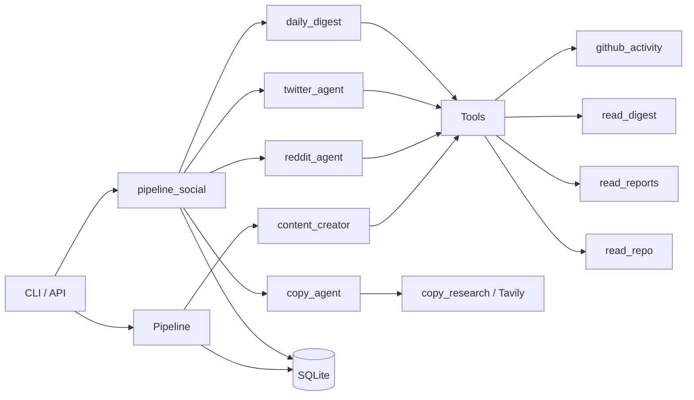

# Social Content Advisor

AI-powered multi-platform social content drafting from GitHub activity, research reports, and competitive copy analysis. Supports **LinkedIn**, **Reddit**, and **Twitter/X** with platform-specific tone, format, and safety rules.

> Originally a LinkedIn-only tool — the `linkedin-advisor` CLI binary remains backward compatible. The new `social` command group adds Reddit + Twitter + cross-platform features.

## Quick Start

```bash
# Clone and install
git clone https://github.com/ShonP/linkedin-advisor.git
cd linkedin-advisor
uv sync

# Configure
cp .env.example .env  # Edit with your API keys

# Generate your first draft (LinkedIn — backward compatible)
linkedin-advisor draft generate

# Multi-platform
linkedin-advisor social draft --platform reddit --subreddit programming
linkedin-advisor social draft --platform twitter --thread
linkedin-advisor social draft --platform all --topic "Azure Container Apps"

# Run a daily digest from GitHub activity → 3-5 cross-platform proposals
linkedin-advisor social digest

# Research successful patterns in a niche
linkedin-advisor social copy-research --niche "AI engineering"
```

## Configuration

Create a `.env` file with:

```env
AZURE_API_KEY=your-azure-openai-key
OPENAI_BASE_URL=https://your-endpoint.openai.azure.com/openai
MODEL=gpt-5.5
TAVILY_API_KEY=your-tavily-key
GITHUB_USERNAME=YourGitHub
AZURE_IMAGE_ENDPOINT=https://your-endpoint.openai.azure.com/openai/deployments/gpt-image-2/images/generations?api-version=2025-04-01-preview
```

## CLI Reference

### LinkedIn-only commands (backward compatible)

```bash
linkedin-advisor draft generate [--topic TOPIC]
linkedin-advisor draft list [--status pending|approved|rejected|all]
linkedin-advisor draft show <ID>
linkedin-advisor draft approve <ID>
linkedin-advisor draft reject <ID>
linkedin-advisor draft edit <ID> <instructions>
linkedin-advisor draft regenerate <ID>
linkedin-advisor draft preview <ID>
```

### Multi-platform `social` commands

```bash
# Generate drafts
linkedin-advisor social draft --platform linkedin|reddit|twitter|all [--topic ...] \
                              [--subreddit programming] [--allow-self-promo] [--thread]

# Daily digest: scans GitHub last 24h + reports, produces 3–5 ContentProposals
linkedin-advisor social digest [--topic ...]

# Copy research: search Tavily for top posts in a niche, extract patterns
linkedin-advisor social copy-research --niche "AI engineering" \
                                      [--platforms linkedin,reddit,twitter]

# Manage drafts
linkedin-advisor social list [--status pending|approved|rejected|all] \
                             [--platform linkedin|reddit|twitter|all]
linkedin-advisor social approve <ID>
linkedin-advisor social reject <ID>

# Inspect digest output and analyses
linkedin-advisor social proposals [--status pending|approved|rejected]
linkedin-advisor social analyses
```

### Image / Server

```bash
linkedin-advisor image generate <prompt> [--filename name.png]
linkedin-advisor serve [--host 0.0.0.0] [--port 8000]
```

## Architecture



### Module Overview

| Module | Purpose |
|--------|---------|
| `cli.py` / `cli_draft.py` / `cli_social.py` | Click CLI: legacy `draft`, multi-platform `social` group |
| `pipeline.py` | Orchestrates LinkedIn draft creation, editing, preview |
| `pipeline_social.py` | Orchestrates Reddit / Twitter / digest / copy-research flows |
| `agents/content_creator.py` | LinkedIn LLM agent (Hebrew, storytelling) |
| `agents/reddit_agent.py` | Reddit agent with **hard anti-ban rules** + safe-subreddit allowlist |
| `agents/twitter_agent.py` | Twitter/X agent with 280-char validation + thread support |
| `agents/copy_agent.py` | Strategist agent that runs Tavily research and emits `CopyAnalysis` |
| `agents/daily_digest.py` | Scans GitHub activity + reports → 3-5 `ContentProposal`s |
| `models/post.py` | `PostDraft` with `platform: linkedin\|reddit\|twitter` |
| `models/reddit.py` | `RedditPost` (title, body, subreddit, flair, post_type, self_promo_level) |
| `models/twitter.py` | `TwitterPost` (text ≤280, thread, hashtags) |
| `models/copy.py` | `CopyAnalysis`, `Pattern`, `ToneGuideline`, `PostExample` |
| `models/proposal.py` | `ContentProposal`, `DailyDigest` |
| `tools/copy_research.py` | Tavily-based search across LinkedIn/Reddit/X |
| `tools/github_activity.py` | Recent commits/PRs via `gh` CLI |
| `tools/read_digest.py`, `read_reports.py`, `read_repo.py` | Local context tools |
| `tools/generate_image.py` | gpt-image-2 diagram generation |
| `db.py` / `db_schema.py` | SQLite storage for drafts, copy analyses, proposals, reddit safety |
| `preview.py` | Dark-mode LinkedIn post preview renderer |
| `middleware.py` | LLM call logging, caching, retry, token tracking |
| `api/server.py` | FastAPI server with swipe UI |
| `config.py` | Pydantic settings from `.env` |

## Platform-Specific Rules

### LinkedIn
- 1200–1500 chars, professional storytelling tone
- Hebrew is OK, value-first opening hook
- Optional architecture diagram for technical posts

### Reddit (CRITICAL — anti-ban)
The Reddit agent enforces strict anti-ban rules at both prompt and code level:

- **Allowlisted subreddits only**: `programming`, `ExperiencedDevs`, `Python`, `node`, `MachineLearning`, `devops`, `LocalLLaMA`, `learnprogramming`. Anything else falls back to `programming`.
- **`self_promo_level` clamped to ≤ 1** unless `--allow-self-promo` is explicitly set.
- **No links to own content** in early posts. Comment & build karma first.
- **Discussion-style, not promotional** — TIL, questions, helpful answers, show-and-tell only after karma.
- **Match subreddit culture** — agent reads typical sub conventions before writing.
- **Tracking**: `reddit_safety` table records `posts_count` and `last_post_at` per subreddit so you can audit pacing.

> 90% value, 10% promotion MAX. Repeated promotional posts will get the account banned.

### Twitter/X
- ≤ 280 chars per tweet (validated via Pydantic field validator)
- Thread mode: list of tweets each ≤ 280 chars
- Punchy hook, emoji OK, focused hashtags

## How It Works

### LinkedIn flow (existing)
1. **Content Discovery** — agent calls `github_activity`, `read_reports`, `read_digest`
2. **Draft Generation** — structured Hebrew post (hook, body, category, image suggestion)
3. **Diagram** — for technical posts, generate architecture diagram via gpt-image-2
4. **Preview** — render dark-mode LinkedIn preview PNG
5. **Review** — `pending` → approve/reject/edit/regenerate

### Multi-platform flow (new)
1. **`social digest`** runs `daily_digest` → reads GitHub last 24h + reports → emits `DailyDigest` with 3–5 `ContentProposal`s saved to the `proposals` table
2. **`social copy-research`** runs `copy_agent` → calls Tavily across LinkedIn/Reddit/X for the niche → emits `CopyAnalysis` (patterns, examples, tone) saved to `copy_analyses`
3. **`social draft --platform reddit|twitter|linkedin|all`** runs the platform agent and saves a `PostDraft` plus the platform-specific row data (subreddit, thread, hashtags) to `drafts`
4. **`social list` / `approve` / `reject`** — same approval workflow as LinkedIn, filterable by platform

## Data Storage

All data is stored locally in `data/`:

```
data/
├── posts.db        # SQLite: drafts + copy_analyses + proposals + reddit_safety
├── images/         # Generated diagram images
└── previews/       # LinkedIn post preview PNGs
```

### Schema highlights
- **`drafts`** — extended with `platform`, `reddit_subreddit`, `reddit_flair`, `reddit_post_type`, `twitter_thread_json`, `twitter_hashtags_json`, `proposal_reasoning`, `confidence_score` (added via idempotent `ALTER TABLE` migrations)
- **`copy_analyses`** — `id`, `niche`, `platforms`, `analysis_json`, `created_at`
- **`proposals`** — `id`, `platform`, `headline`, `angle`, `reasoning`, `confidence`, `suggested_subreddit`, `source_summary`, `status`, `created_at`
- **`reddit_safety`** — `subreddit`, `posts_count`, `last_post_at`, `karma_estimate`, `account_created_at`

## Cost Estimate

| Operation | Estimated Cost |
|-----------|---------------|
| LinkedIn draft (GPT-5.5) | ~$0.01–0.03 |
| Reddit / Twitter draft | ~$0.005–0.02 |
| Daily digest (3–5 proposals) | ~$0.02–0.05 |
| Copy research (Tavily + LLM) | ~$0.01–0.03 |
| Diagram (gpt-image-2) | ~$0.02–0.08 |

## Development

```bash
uv run ruff check advisor/          # Lint
uv run ruff format advisor/         # Format
uv run pyright                       # Type check
```

## License

Private repository.
